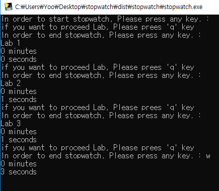

# StopWatch
> This is simply stopwatch.

Time spent is measured using python.

## Create Reason

While i am studying TOEIC, i want to stopwatch.

## Usage example

This is start message. Please  press any key and 'enter' key!

> input("In order to start stopwatch, Please press any key. : ")

"now" value is checking time now.
> now = time.gmtime(time.time())

This is end message and executing Lab message. if you want to execute Lab function, Please press enter key 

"temp" value is checking whether you want to quit program or excute Lab function.

> temp = input("if you want to excute Lab, Please press enter key\nIn order to end stopwatch, Please press any key. : ")

"last" value is checking final time.
> last = time.gmtime(time.time())

Finally, press any key and 'enter' key, so the program will end.

## Release History
* 0.2.1
	* Fix Lab function
* 0.2.0
	* Add Lab function
* 0.1.1
	* Translate Korean into English.
* 0.1.0
  * The first proper release
* 0.0.1
    * Work in progress

## Meta

Yoo Hyeong Jun – [@youjyeong6](https://www.instagram.com/youhyeong6) –

 jhdf1234@naver.com

## Contributing

1. Fork it (<https://github.com/yourname/yourproject/fork>)
2. Create your feature branch (`git checkout -b feature/fooBar`)
3. Commit your changes (`git commit -am 'Add some fooBar'`)
4. Push to the branch (`git push origin feature/fooBar`)
5. Create a new Pull Request
